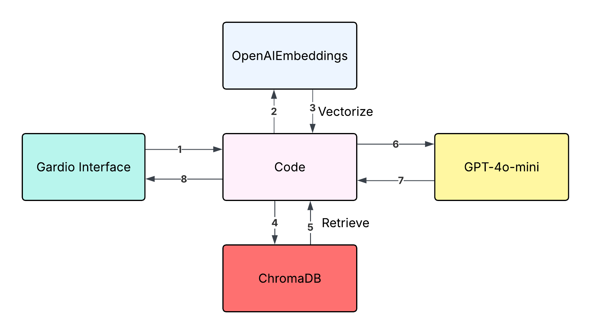

# KnowledgeAssistant

# 💬 KnowledgeAssistant using RAG with GPT-4o-Mini, ChromaDB & Vector Visualization

A question answering agent that is an expert knowledge worker .  This project will use RAG (Retrieval Augmented Generation) to ensure our question/answering assistant has high accuracy.

An intelligent, interactive chatbot built with **LangChain**, **GPT-4o-mini**, **ChromaDB**, and **Gradio**. This project allows you to chat with your own Markdown-based knowledge base and visualize document embeddings in 2D and 3D using **t-SNE**.

> 🔍 Ask your documents anything. Visualize how knowledge is stored. Run locally with ease.

---

## 🧠 Features

- 🤖 Powered by **GPT-4o-mini** for fast and intelligent responses
- 📁 Automatically loads and embeds your `.md` files from a knowledge base
- 🧩 Text chunking with metadata tagging for better semantic indexing
- 🧠 Memory-enabled conversation with **LangChain's ConversationalRetrievalChain**
- 🧠 Persistent **Chroma Vector Store** with OpenAI or HuggingFace embeddings
- 📊 Stunning **2D & 3D Visualizations** of document embeddings via t-SNE
- 💬 Beautiful **Gradio Chat UI** with in-browser launch

